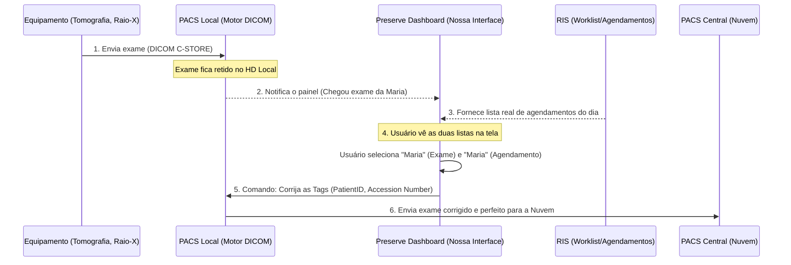

# Preserve - DICOM Contingency Dashboard
## Apresentação Executiva do Projeto

> [!NOTE]
> **O que é este sistema?**
> Uma Staging Zone (Zona de Retenção) inteligente para imagens radiológicas, desenvolvida para atuar como contingência de rede e painel de reconciliação de dados antes do envio ao PACS principal.

### 🔴 O Problema Atual (A Dor)
1. **Queda de Link Externo:** O hospital/clínica possui um link com o PACS em Nuvem/Central. Quando este link cai, a operação trava ou os exames ficam retidos no PACS local de forma "cega".
2. **Exames Órfãos:** Exames enviados pelos equipamentos (raio-x, tomografia, etc) sem o *Accession Number* correto não conseguem ser vinculados ao laudo quando o link volta. Isso gera transtorno, perda de tempo da equipe médica e risco de atraso na emissão do laudo.

### 🟢 A Nossa Solução (O Projeto)
Um **painel web moderno e seguro** que se acopla ao PACS Local existente, transformando-o em um **motor DICOM inteligente**.
Ao invés do envio ser automático e cego com informações incorretas, o sistema segura as imagens e permite que a equipe:
- Visualize os exames que chegaram em tempo real.
- Identifique facilmente imagens com dados incorretos ou faltantes.
- Cruze visualmente a lista de exames com a *Worklist* real de pacientes agendados no dia.
- Realize o vínculo e o envio seguro com apenas um clique.

---

## 🛠️ Arquitetura e Fluxo de Dados

Abaixo, a representação visual de como a nossa solução resolve o problema se encaixando na infraestrutura atual:

---

## 💻 O Fluxo de Trabalho (Passo a Passo da Interface)

### 1️⃣ Recepção e Alertas (Modo Contingência)
O sistema monitora a rede continuamente. Se o link externo cair, o status visual muda para vermelho (Offline). Todos os exames que os técnicos realizarem continuarão chegando normalmente na **coluna da esquerda (Estudos Recebidos)**, em um ambiente seguro e sem travamentos. O fluxo de exames na clínica nunca para.

### 2️⃣ Análise Visual Intuitiva
A tela se divide em duas partes principais:
- **Lado Esquerdo:** O que realmente chegou da máquina (geralmente contendo erros de digitação e ausência de códigos devido à correria do plantão).
- **Lado Direito:** A *Worklist* oficial, puxada direto do banco de dados do RIS do hospital, contendo o paciente com os códigos e números de acesso exatos.

### 3️⃣ A Ação "Vincular" (Match)
O usuário clica no exame retido e depois clica no paciente correspondente na Worklist. Um botão **"Confirmar Vínculo"** aparece na tela.

> [!TIP]
> **Por que isso é inovador?**
> Ao apertar esse botão, o atendente não precisa abrir nenhum software pesado de edição DICOM ou digitar manualmente dezenas de campos complexos. A correção do cabeçalho da imagem é feita de forma silenciosa pelo nosso backend, que em seguida dispara o arquivo perfeito para o servidor externo.

### 4️⃣ Histórico e Rastreabilidade
Na parte inferior do painel, o sistema possui um "Log de Operações" que registra em tempo real quem enviou o quê, e a que horas. Isso garante auditoria completa e segurança do paciente.

---

## 🔒 Segurança e Conformidade LGPD (Lei 13.709/18)

O projeto foi atualizado com foco em **Privacy by Design** e segurança no tratamento de dados pessoais sensíveis de saúde (PHI/PII):

* **Privacy by Default (Modo de Privacidade):** O sistema inicia com os dados sensíveis dos pacientes mascarados na interface por padrão (ex: `Maria da Silva` torna-se `M*** da S***`, e datas de nascimento tornam-se `**/**/1980`). O operador pode desativar o mascaramento temporariamente no cabeçalho.
* **Criptografia Local de Dados (Rest):** Toda informação persistida no `localStorage` (estudos, worklist e configurações) é criptografada de forma simétrica usando algoritmo com salt UTF-8 para evitar inspeção de terceiros ou em ferramentas de desenvolvedor.
* **Descarte Seguro de Dados (Zero Trace):** Ao efetuar o *logout* do sistema, todas as chaves sensíveis e dados de saúde de pacientes são inteiramente apagados do `localStorage` e da memória do navegador.
* **Auto-Logout por Inatividade:** Bloqueio automático de sessão após 5 minutos sem interação do operador, protegendo o terminal em ambientes clínicos compartilhados.
* **Trilha de Auditoria Estrita:** O log de auditoria interno registra ações sensíveis, identificando o operador responsável (DRT) quando há visualização de detalhes do paciente ou confirmação de vínculos.

---

## 🚀 Status do Projeto
* **Design de Interface & LGPD:** 100% Concluído e em conformidade.
* **Lógica de Contingência e Alertas:** 100% Concluído.
* **Experiência do Usuário (UI/UX):** 100% Concluído.
* **Próxima Fase:** Acoplamento desta interface aos motores reais de PACS e RIS do hospital através da equipe de Engenharia/TI.

